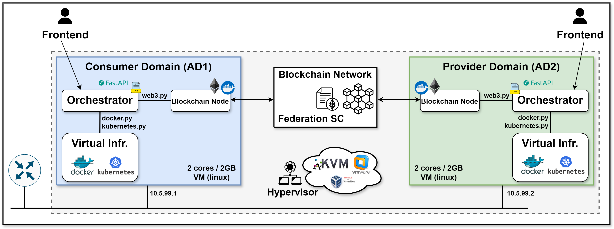
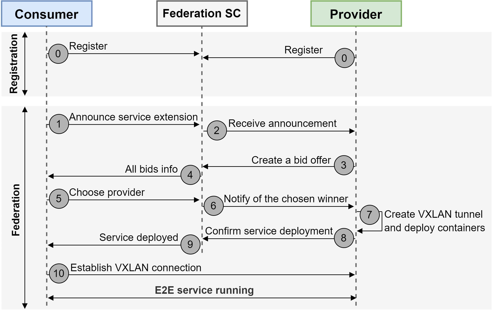

# DLT-based Service Federation

## Overview

Service federation is a feature of NFV MANO that enables the orchestration of services across multiple administrative domains (ADs). This project showcases how different ADs can establish federation efficiently using distributed ledger technologies (DLTs). More specifically, the federation procedures are stored and deployed on a Federation Smart Contract (SC), which is running on top of a permissioned blockchain. Each AD sets up a blockchain node to gain access to the blockchain network and interacts with the Federation SC by sending transactions.

**Author:** Adam Zahir Rodriguez

[OpenAPI Documentation](https://app.swaggerhub.com/apis/ADAMZR2000/dlt-service_federation_api/1.0.0)

## Experimental Setup

Here is a diagram that represents visually the experimental setup:



- Two or more Virtual Machines (VMs), each acting as a separate AD with [Docker](https://docs.docker.com/engine/install/ubuntu) and/or [Kubernetes](https://kubernetes.io/) installed.
- All VMs are interconnected in bridge mode.
- All VMs have access to a blockchain node.

## Workflow

- **Step 0**: ADs register in the Federation SC
- **Step 1**: AD1 decides it needs service extension and requests federation.
- **Steps 2 and 3**: AD2 receives the federation request and responds by submitting a bid-offer transaction with its service price.
- **Steps 4 and 5**: AD1 receives the bid offer, selects AD2 as winning provider, and reveals its service endpoint.
- **Steps 6, 7, and 8**: AD2 is notified of being the selected provider and deploys the requested federated service. This includes creating a Docker network in default bridge mode, setting up a VXLAN tunnel with AD1 (using the service endpoint shared via the Federation SC), attaching the VXLAN interface to the Docker bridge, and deploying the requested containers in the Docker network.
- **Step 8**: Once the containers are deployed in the overlay network, AD2 sends a confirmation transaction with connection details of the federated service and reveals its service endpoint.
- **Steps 9 and 10**: AD1 receives the deployment confirmation and establishes VXLAN connectivity with AD2, enabling inter-domain communication.



## Installation

1. Clone the repository:
```bash
git clone git@github.com:adamzr2000/d6g-dlt-federation.git
```

2. Build Docker Images:
Navigate to the [docker-images](./docker-images) directory and run the `./build.sh` scripts for each image:

- `dlt-node`: Based on [Go-Ethereum (Geth)](https://geth.ethereum.org/docs) software, serving as nodes within the peer-to-peer blockchain network. (detailed info [here](./docker-images/dlt-node/)).  Available

- `truffle`: Development framework for Ethereum-based blockchain applications. It provides a suite of tools that allows developers to write, test, and deploy smart contracts. (detailed info [here](./docker-images/truffle/)).  Available

3. Install Python dependencies:
```bash
pip3 install -r requirements.txt
```

4. Depending on the platform for federation (Docker or Kubernetes), follow the corresponding setup:

- For Docker: Refer to [./utils/docker-federation](./utils/docker-federation)
- For Kubernetes: Refer to [./utils/kubernetes-federation](./utils/kubernetes-federation)

## Blockchain Network Setup

Create a blockchain network using `dlt-node` containers.  Initially, the network will comprise two nodes, corresponding to AD1 and AD2, respectively. AD1 will serve as the bootnode to connect both nodes.

1. Initialize the network:

In `AD1`, go to the [dlt-network-docker](./dlt-network-docker) directory and start the network setup:

> Note: Before running the script, update the IP addresses in [node1.env](./config/dlt/node1.env) and [node2.env](./config/dlt/node2.env). Replace `IP_NODE_1` with the IP address of your `AD1` and `IP_NODE_2` with the IP address of your `AD2`.

```bash
cd dlt-network-docker
./start_dlt_network.sh
```

2. Join the network from a second node

In `AD2`, go to the [dlt-network-docker](./dlt-network-docker) directory and run:

```bash
cd dlt-network-docker
./join_dlt_network.sh node2 2
```

3. Verify node association

Use the following commands to confirm both nodes are connected:

```bash
# AD1
 ./get_peer_nodes.sh node1

# AD2  
 ./get_peer_nodes.sh node2
```
Each command should show `1 peer`.

Access the `grafana` dashboard for additional information at [http://localhost:3000](http://localhost:3000)

> Note: The username is `desire6g` and the password `desire6g2024;`.

4. Add more nodes:

Use the [join_dlt_network.sh](./dlt-network-docker/join_dlt_network.sh) script to add more nodes. 

> Note: The private network uses the [Clique (Proof-of-authority)](https://github.com/ethereum/EIPs/issues/225) consensus mechanism, where pre-elected signer nodes generate new blocks. Each new block is endorsed by the list of signers, and the last signer node is responsible for populating the new block with transactions. Block rewards are shared among all the signers. New nodes must be approved by at least `(NUMBER_OF_TOTAL_SIGNERS / 2) + 1` signers to join as "sealers." 

To add a new node as a sealer, run the [add_validator.sh](./dlt-network-docker/add_validator.sh) script.

For example, to add a third node as a sealer in the blockchain, use the following commands:

```bash
# AD3
 ./join_dlt_network.sh node3 2

# AD1
./add_validator.sh node1 node3

# AD2 
./add_validator.sh node2 node3
```

Finally, check if the new node has been accepted as a sealer node with:

```bash
# AD3
./get_peer_nodes.sh node3 
```

5. Stop the network:

In `AD1`, when needed, use the following command to stop the network:

```bash
./stop_dlt_network.sh
```

## Usage

1. Deploy the Federation SC to the blockchain Network:

```bash
cd smart-contracts
./deploy.sh 
```

2. Run the DLT Service Federation module on each AD, specifying the domain parameters in the [federation](./dlt-network-docker/) directory. Use at least the following files:

   - [consumer1.env](./config/federation/consumer1.env)
   - [provider1.env](./config/federation/provider1.env)

> Note: Before running the script, set `DOMAIN_FUNCTION` to your federation role (`consumer` or `provider`), update `INTERFACE_NAME` to your VM's network interface for the VXLAN tunnel, and set `SUDO_PASSWORD` to your machine's password for scripts requiring elevated privileges, such as network configuration and VXLAN setup.

```bash
# AD1
./start_app.sh --env-file config/federation/consumer1.env

# AD2
./start_app.sh --env-file config/federation/provider1.env
```

For more details on federation functions, refer to the FastAPI documentation at [http://localhost:8000/docs](http://localhost:8000/docs)

3. Register each AD in the Federation SC:

```bash 
curl -X POST 'http://localhost:8000/register_domain' \
-H 'Content-Type: application/json' \
-d '{
   "name": "<domain_name>"
}'
```

3. Start listening for federation events on the provider ADs:

> Note: This simulates the provider-side service federation process, including bid placement, 
waiting for selection, and service deployment.

```bash
curl -X POST 'http://localhost:8000/simulate_provider_federation_process' \
-H 'Content-Type: application/json' \
-d '{
   "vim": "<docker/kubernetes>", 
   "export_to_csv": <true/false>, 
   "service_price": <federation_price_offering (e.g., 10)>,
   "endpoint_provider": "ip_address=10.5.99.2;vxlan_id=200;vxlan_port=4789;federation_net=10.0.0.0/16"
}'
```

4. Trigger a federation request from the consumer AD:

> Note: This simulates the consumer-side service federation process, including service announcement, bid evaluation, and provider selection.

```bash
curl -X POST 'http://localhost:8000/simulate_consumer_federation_process' \
-H 'Content-Type: application/json' \
-d '{
   "vim": "<docker/kubernetes>", 
   "export_to_csv": <true/false>, 
   "service_providers": <federation_offers_to_wait (e.g., 1)>,
   "requirements": "service=alpine;replicas=1", 
   "endpoint_consumer": "ip_address=10.5.99.1;vxlan_id=200;vxlan_port=4789;federation_net=10.0.0.0/16"
}'
```

## DLT Federation API Endpoints

### Web3 Info
Returns `web3_info` details, otherwise returns an error message.

```sh
curl -X GET 'http://localhost:8000/web3_info' | jq
```

### Transaction Receipt
Returns `tx-receipt` details for a specified `tx_hash`, otherwise returns an error message.

```sh
curl -X GET 'http://localhost:8000/tx_receipt?tx_hash=<tx_hash>' | jq
```

### Register Domain
Returns the `tx_hash`, otherwise returns an error message.

```sh
curl -X POST 'http://localhost:8000/register_domain' \
-H 'Content-Type: application/json' \
-d '{
   "name": "<domain_name>"
}'
```

### Unregister Domain
Returns the `tx_hash`, otherwise returns an error message.

```sh
curl -X DELETE 'http://localhost:8000/unregister_domain'
```

### Create Service Announcement
Returns the `tx_hash` and `service-id` for federation, otherwise returns an error message.

```sh
curl -X POST 'http://localhost:8000/create_service_announcement' \
-H 'Content-Type: application/json' \
-d '{
   "requirements": "service=alpine;replicas=1", 
   "endpoint_consumer": "ip_address=10.5.99.1;vxlan_id=200;vxlan_port=4789;federation_net=10.0.0.0/16"
}'
```

```sh
curl -X POST 'http://localhost:8000/create_service_announcement' \
-H 'Content-Type: application/json' \
-d '{
   "requirements": "service=alpine-pod-federation.yaml;replicas=1", 
   "endpoint_consumer": "ip_address=10.5.99.1;vxlan_id=200;vxlan_port=4789;federation_net=10.0.0.0/16"
}'
```

### Check Service Announcements
Returns `announcements` details, otherwise, returns an error message.

```sh
curl -X GET 'http://localhost:8000/check_service_announcements' | jq
```

### Place Bid
Returns the `tx_hash`, otherwise returns an error message.

```sh
curl -X POST 'http://localhost:8000/place_bid' \
-H 'Content-Type: application/json' \
-d '{
   "service_id": "<id>", 
   "service_price": <federation_price_offering (e.g., 10)>,
   "endpoint_provider": "ip_address=10.5.99.2;vxlan_id=200;vxlan_port=4789;federation_net=10.0.0.0/16"
}'
```

### Check Bids
Returns `bids` details, otherwise returns an error message.

```sh
curl -X GET 'http://localhost:8000/check_bids?service_id=<id>' | jq
```

### Choose Provider
Returns the `tx_hash`, otherwise returns an error message.

```sh
curl -X POST 'http://localhost:8000/choose_provider' \
-H 'Content-Type: application/json' \
-d '{
   "bid_index": <index>, 
   "service_id": "<id>"
}'
``` 

### Check Winner
Returns the `am-i-winner`, which can be `yes`, or `no`; otherwise, returns an error message.

```sh
curl -X GET 'http://localhost:8000/check_winner?service_id=<id>' | jq
```

### Check if I am Winner
Returns the `winner-chosen`, which can be `yes`, or `no`; otherwise, returns an error message.

```sh
curl -X GET 'http://localhost:8000/check_if_i_am_winner?service_id=<id>' | jq
```

### Confirm Service Deployment
Returns the `service-name`, otherwise returns an error message.

```sh
curl -X POST 'http://localhost:8000/service_deployed' \
-H 'Content-Type: application/json' \
-d '{
   "service_id": "<id>",
   "federated_host": "<federated_host_ip>"
}'
```

### Check Service State
Returns the `state` of the federated service, which can be `open`,`closed`, or `deployed`; otherwise, returns an error message.

```sh
curl -X GET 'http://localhost:8000/check_service_state?service_id=<id>' | jq
```

### Check Deployed Info
Returns the `service_endpoint` of the provider and `federated_host` (IP address of the deployed service); otherwise, returns an error message.

```sh
curl -X GET 'http://localhost:8000/check_deployed_info?service_id=<id>' | jq
```

## Docker API Endpoints

### Deploy Docker Service

```sh
curl -X POST 'http://localhost:8000/deploy_docker_service?image=alpine&name=<service_name>&network=<docker-network>&replicas=<number-of-replicas>' | jq
```

### Delete Docker Service

```sh
curl -X DELETE 'http://localhost:8000/delete_docker_service?name=<service_name>' 
```

### Configure Docker Network Resources (VXLAN configuration and Docker network)

```sh
curl -X POST 'http://localhost:8000/configure_docker_network_resources' \
-H 'Content-Type: application/json' \
-d '{
   "local_ip": "10.5.99.1", 
   "remote_ip": "10.5.99.2",
   "interface_name": "ens3",
   "vxlan_id": "200",
   "dst_port": "4789",
   "subnet": "10.0.0.0/16",
   "ip_range": "10.0.1.0/24",
   "net_name": "federation-net"
}'
```

### Delete Docker Network Resources (VXLAN configuration and Docker network)

```sh
curl -X DELETE 'http://localhost:8000/delete_docker_network_resources?vxlan_id=<vxlan_id>&net_name=<federation-network-name>'
```

### Execute command in a Docker Container

```sh
curl -X POST 'http://localhost:8000/execute_command_in_docker_container' \
-H 'Content-Type: application/json' \
-d '{
   "name": "alpine_1", 
   "command": "ping -c 10 0.0.0.0"
}' | jq
```

## Kubernetes API Endpoints

### Deploy K8s Service

```sh
curl -X POST 'http://localhost:8000/deploy_kubernetes_service?descriptor=alpine-pod.yaml' | jq
```

### Delete K8s Service

```sh
curl -X DELETE 'http://localhost:8000/delete_kubernetes_service?descriptor=alpine-pod.yaml' 
```

### Configure K8s Network Resources (VXLAN configuration and Multus network)

```sh
curl -X POST 'http://localhost:8000/configure_kubernetes_network_resources' \
-H 'Content-Type: application/json' \
-d '{
   "local_ip": "10.5.99.1", 
   "remote_ip": "10.5.99.2",
   "interface_name": "ens3",
   "vxlan_id": "200",
   "dst_port": "4789",
   "subnet": "10.0.0.0/16",
   "ip_range": "10.0.1.1-10.0.1.255",
   "net_name": "federation-net"
}'
```

### Delete K8s Network Resources (VXLAN configuration and Multus network)

```sh
curl -X DELETE 'http://localhost:8000/delete_kubernetes_network_resources?vxlan_id=<vxlan_id>&net_name=<federation-network-name>'
```

### Execute command in a K8s Pod

```sh
curl -X POST 'http://localhost:8000/execute_command_in_kubernetes_pod' \
-H 'Content-Type: application/json' \
-d '{
   "name": "alpine-pod", 
   "command": "ping -c 10 0.0.0.0"
}' | jq
```